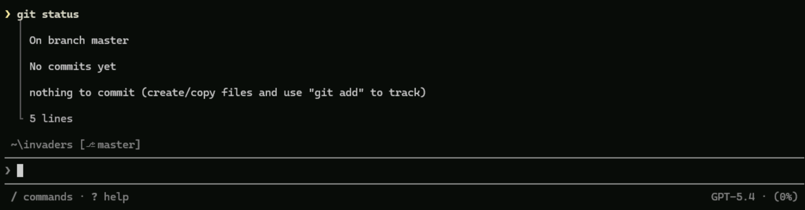

# 01. Copilot CLI 환경 설정

이 문서는 원본 `01-setting-up-the-environment.md`를 한국어로 정리한 Copilot CLI 기준 실습입니다. 목표는 작업 폴더를 만들고, Git 저장소를 초기화하고, Copilot CLI에 로그인하는 것입니다.

## 준비

Windows Terminal 또는 PowerShell을 엽니다. 긴 프롬프트를 붙여 넣을 일이 많으므로 터미널 창을 넓게 열어 두는 것을 권장합니다.

## 작업 폴더 생성

실습용 폴더를 만들고 Git 저장소로 초기화합니다.

```powershell
mkdir invaders
cd invaders
git init
```

Git 저장소는 필수는 아니지만, Copilot CLI의 변경 되돌리기와 diff 확인 흐름을 쓰기 위해 초기화해 두는 것이 좋습니다.

## Copilot CLI 업데이트와 로그인

Copilot CLI를 최신 버전으로 업데이트합니다.

```powershell
copilot update
```

대화형 세션을 시작합니다.

```powershell
copilot
```


처음 실행하면 현재 폴더를 신뢰할지 묻습니다. 실습 폴더가 맞으면 신뢰를 선택합니다. 멀티라인 입력 설정을 묻는 경우 `Yes`를 선택하면 긴 프롬프트를 작성할 때 편합니다.

세션 안에서 로그인합니다.

```text
/login
```

브라우저 인증 흐름을 완료하면 Copilot CLI를 사용할 수 있습니다. 이미 로그인되어 있다면 이 단계는 건너뛰어도 됩니다.

## 기본 사용법

자연어로 질문하거나 작업을 요청합니다.

```text
Python dataclass를 초보자에게 설명해줘.
```

세션 안에서 로컬 shell 명령을 실행하려면 `!`로 시작합니다.

```text
! git status
```



파일 내용을 컨텍스트로 붙이려면 `@`를 사용합니다.

```text
@index.html 코드 품질을 검토해줘.
```

자주 쓰는 slash command입니다.

| 명령 | 용도 |
|---|---|
| `/help` | 사용 가능한 명령 확인 |
| `/model` | 모델 확인 또는 변경 |
| `/new` | 새 대화 시작 |
| `/diff` | 현재 변경사항 확인 |
| `/instructions` | 로드된 instruction 확인 |
| `/skills` | 사용 가능한 skill 확인 |
| `/mcp` | MCP 서버 설정 확인 |
| `/plugin` | plugin과 marketplace 관리 |
| `/exit` | 세션 종료 |

## 모드 전환

Copilot CLI는 작업 방식에 따라 모드를 바꿔 사용할 수 있습니다.

| 모드 | 설명 |
|---|---|
| Interactive | 질문과 답변 중심의 기본 대화 |
| Plan | 구현 전 계획을 먼저 만들고 검토 |
| Autopilot | 승인 부담을 줄이고 계획 실행을 자동화 |

대화형 세션에서는 `Shift+Tab`으로 모드를 순환하거나, 프롬프트 앞에 `/plan`을 붙여 plan mode를 사용할 수 있습니다.

## 확인

아래 명령으로 현재 상태를 확인합니다.

```text
/env
! git status
```

정상 기준은 다음입니다.

- 현재 작업 폴더가 `invaders`
- Git 저장소가 초기화됨
- Copilot CLI 로그인 완료
- GitHub MCP 또는 기본 도구가 로드됨

## 다음 단계

다음 문서에서는 LAB502 커뮤니티 plugin marketplace를 등록하고 `space-invaders-makers` plugin을 설치합니다.

[이전: 소개](00-intro.ko.md) | [다음: 커뮤니티 plugin 설치](02-installing-the-community-plugin.ko.md)

## 참고

- 원본 LAB502 01: <https://github.com/microsoft/Build26-LAB502-make-github-copilot-work-your-way-custom-tools-context-and-workflows/blob/main/docs/01-setting-up-the-environment.md>
- Copilot CLI 시작: <https://docs.github.com/copilot/how-tos/copilot-cli>
- Copilot CLI command reference: <https://docs.github.com/en/copilot/reference/copilot-cli-reference/cli-command-reference>
- Copilot CLI 소개: <https://docs.github.com/en/copilot/concepts/agents/copilot-cli/about-copilot-cli>
