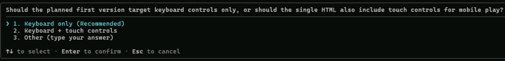

# 03. Space Invaders 게임 생성

이 문서는 원본 `03-generating-the-space-invaders-game.md`를 한국어로 다시 구성한 Copilot CLI 실습입니다. 목표는 plan mode를 사용해 단일 HTML 파일로 실행 가능한 Space Invaders 스타일 게임을 만드는 것입니다.

## Plan mode

기본 agent mode는 요청을 받으면 바로 구현을 시작합니다. 반면 plan mode는 구현 전에 요구사항을 정리하고, 필요한 질문을 하고, 실행 계획을 만든 뒤 사용자가 승인하면 코드를 작성합니다.

복잡한 작업에서는 plan mode가 유리합니다.

- Copilot이 잘못 이해한 부분을 구현 전에 잡을 수 있습니다.
- 기능 범위와 제약을 먼저 합의할 수 있습니다.
- 승인 전에는 파일을 수정하지 않습니다.

대화형 세션에서 `Shift+Tab`으로 Plan 모드를 선택하거나, 프롬프트 앞에 `/plan`을 붙입니다.

## 게임 생성 요청

Copilot CLI를 시작합니다.

```powershell
copilot
```

모델을 확인하거나 바꿔야 하면 다음을 사용합니다.

```text
/model
```

기본 생성 프롬프트입니다.

```text
/plan Generate a Space Invaders game in a single HTML file.
```



한국어로 더 구체화하면 다음처럼 요청할 수 있습니다.

```text
/plan Space Invaders 스타일의 브라우저 게임을 단일 HTML 파일로 만들어줘.
조건:
- HTML, CSS, JavaScript를 모두 한 파일에 포함
- 외부 CDN, npm 패키지, 이미지 파일 사용 금지
- 키보드 조작과 점수 표시 포함
- 시작 화면, 게임 오버, 재시작 기능 포함
- Microsoft Build 2026 느낌의 색상과 UI 적용
```

계획이 나오면 검토합니다. 부족한 기능이 있으면 바로 구현하지 말고 계획 수정부터 요청합니다.

```text
계획에 모바일 터치 조작과 난이도 증가 규칙을 추가해줘.
```

계획이 맞으면 승인해 빌드를 진행합니다. 실행 중 권한 확인이 많이 뜨면 `/allow-all`을 사용할 수 있지만, 수업에서는 어떤 도구를 실행하는지 확인하며 진행하는 것을 권장합니다.


## 결과 확인

생성이 끝나면 변경사항을 확인합니다.


```text
/diff
```

정상 기준은 다음입니다.

- `.html` 파일 하나가 생성됨
- CSS와 JavaScript가 HTML 안에 포함됨
- 외부 CDN 또는 npm 설정 파일이 없음
- 브라우저에서 바로 실행 가능

PowerShell에서 HTML 파일을 브라우저로 열려면 Copilot 세션에서 shell 명령을 실행합니다.

```text
! start .\index.html
```

파일명이 다르면 실제 파일명을 사용합니다.

```text
! start .\<생성된-html-파일명>
```

게임을 한 번 실행해 보고 문제가 있으면 증상을 구체적으로 말해 수정합니다.

```text
@index.html 플레이어 총알이 적에게 맞아도 점수가 올라가지 않아. 원인을 찾아 수정해줘.
```

## Plugin 내부 구조 이해

앞 장에서 설치한 `space-invaders-makers` plugin은 뒤의 공유 실습을 위해 여러 구성요소를 제공합니다.

| 구성요소 | 의미 |
|---|---|
| custom agent | `web-screenshotter`가 브라우저 자동화와 스크린샷 공유 흐름을 담당 |
| skill | `share-screenshot`이 이미지 업로드 절차를 담당 |
| MCP server | Playwright MCP가 브라우저 조작 도구 제공 |
| hooks | 세션과 도구 사용 이벤트를 Community Hub에 전송 |
| scripts | HTTP 업로드나 telemetry 전송 같은 결정적 작업 수행 |

이 구조는 뒤에서 직접 skill을 만들 때도 같은 패턴으로 사용합니다. 모델에게 모든 HTTP 요청을 즉석에서 만들게 하지 말고, 정확해야 하는 부분은 script로 분리하는 것이 안정적입니다.

## 다음 단계

다음 문서에서는 `web-screenshotter` custom agent를 사용해 게임 스크린샷을 캡처하고 공유합니다.

[이전: 커뮤니티 plugin 설치](02-installing-the-community-plugin.ko.md) | [다음: 스크린샷 공유](04-screenshot-sharing.ko.md)

## 참고

- 원본 LAB502 03: <https://github.com/microsoft/Build26-LAB502-make-github-copilot-work-your-way-custom-tools-context-and-workflows/blob/main/docs/03-generating-the-space-invaders-game.md>
- Copilot CLI: <https://docs.github.com/en/copilot/concepts/agents/copilot-cli/about-copilot-cli>
- Copilot CLI command reference: <https://docs.github.com/en/copilot/reference/copilot-cli-reference/cli-command-reference>
- Copilot CLI hooks: <https://docs.github.com/en/copilot/tutorials/copilot-cli-hooks>
