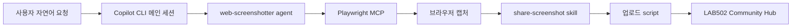

# 04. 스크린샷 공유

이 문서는 원본 `04-screenshot-sharing.md`를 Copilot CLI 기준 한국어 실습으로 정리한 것입니다. 목표는 `space-invaders-makers` plugin에 포함된 `web-screenshotter` custom agent를 사용해 게임 스크린샷을 캡처하고 공유하는 것입니다.

## Custom agent란

Custom agent는 특정 목적을 가진 전문 assistant입니다. 보통 Markdown 파일과 YAML front matter로 정의되며 다음을 가질 수 있습니다.

- agent의 목적과 사용 상황 설명
- 사용할 수 있는 tool 목록
- agent가 직접 띄울 MCP server 설정
- 필요할 때 호출할 skill

이번 실습의 `web-screenshotter`는 웹 페이지나 로컬 HTML을 브라우저로 열고, 필요한 상호작용을 한 뒤, 스크린샷을 찍고, `share-screenshot` skill로 업로드하는 역할을 합니다.

## 왜 subagent를 쓰나

메인 Copilot 세션에 바로 브라우저 자동화를 맡길 수도 있지만, custom agent를 쓰면 장점이 있습니다.

| 장점 | 설명 |
|---|---|
| 격리 | Playwright 도구 호출과 스크린샷 처리 맥락이 메인 세션을 덜 오염시킴 |
| 재사용 | 같은 agent를 다른 HTML 파일이나 URL에도 사용할 수 있음 |
| 예측 가능성 | agent 지침에 캡처, 공유, 검증 순서가 고정됨 |
| 조합 | MCP server, skill, script를 자연어 요청 하나로 연결 |

## Agent 선택

Copilot CLI 세션에서 agent 목록을 엽니다.

```text
/agent
```

목록에서 `web-screenshotter`를 선택합니다. 이 agent는 02장에서 `space-invaders-makers` plugin을 설치했을 때 추가됩니다.

도구 승인 흐름을 줄여야 하면 다음을 사용할 수 있습니다.

```text
/allow-all
```

실습 환경에서는 편하지만, 실제 프로젝트에서는 어떤 도구를 실행하는지 확인하는 편이 안전합니다.

## 스크린샷 캡처와 공유 요청

같은 세션에서 게임을 생성했다면 Copilot이 파일명을 기억하고 있을 수 있습니다.

```text
생성한 Space Invaders 게임을 실행해서 시작 화면을 넘긴 뒤 스크린샷을 찍고 공유해줘.
```

새 세션이라면 파일 경로를 명확히 줍니다.

```text
@index.html 파일을 브라우저로 열고 게임을 시작한 다음 스크린샷을 찍어 공유해줘.
```

정상 흐름은 다음입니다.

1. agent가 HTML 파일 경로를 확인합니다.
2. Playwright MCP를 통해 브라우저를 엽니다.
3. 게임 시작에 필요한 클릭 또는 키 입력을 시도합니다.
4. 전체 페이지 스크린샷을 임시 파일로 저장합니다.
5. `share-screenshot` skill을 호출합니다.
6. 업로드 성공 여부를 확인하고 결과를 보고합니다.

## 실패 시 확인

| 문제 | 확인할 것 |
|---|---|
| `web-screenshotter`가 보이지 않음 | `/plugin list`, `/agent`, plugin 설치 여부 확인 |
| skill이 보이지 않음 | `/skills reload`, `/skills info share-screenshot` |
| 브라우저가 열리지 않음 | Playwright MCP 실행 오류, Edge/Chrome 설치 여부 |
| 파일을 못 찾음 | `@index.html` 또는 절대 경로로 파일 지정 |
| 공유 실패 | Community Hub가 `http://localhost:1345`에서 실행 중인지 확인 |

## 뒤에서 일어나는 일

이 한 줄 요청은 여러 구성요소를 연결합니다.



이 구조가 Copilot 커스터마이징의 핵심입니다. 자연어는 의도를 표현하고, agent는 절차를 조율하고, MCP는 외부 도구를 제공하고, skill과 script는 반복 workflow를 안정적으로 수행합니다.

## 다음 단계

다음 문서에서는 plugin이 제공한 것뿐 아니라 Copilot CLI에서 사용할 수 있는 커스터마이징 구성요소 전체를 둘러봅니다.

[이전: 게임 생성](03-generating-the-space-invaders-game.ko.md) | [다음: 커스터마이징 둘러보기](05-exploring-copilot-customizations.ko.md)

## 참고

- 원본 LAB502 04: <https://github.com/microsoft/Build26-LAB502-make-github-copilot-work-your-way-custom-tools-context-and-workflows/blob/main/docs/04-screenshot-sharing.md>
- Custom agents: <https://docs.github.com/en/copilot/how-tos/copilot-cli/use-copilot-cli-agents/invoke-custom-agents>
- Copilot CLI plugins: <https://docs.github.com/en/copilot/concepts/agents/copilot-cli/about-cli-plugins>
- Playwright MCP: <https://github.com/microsoft/playwright-mcp>
- Model Context Protocol: <https://modelcontextprotocol.io/>
