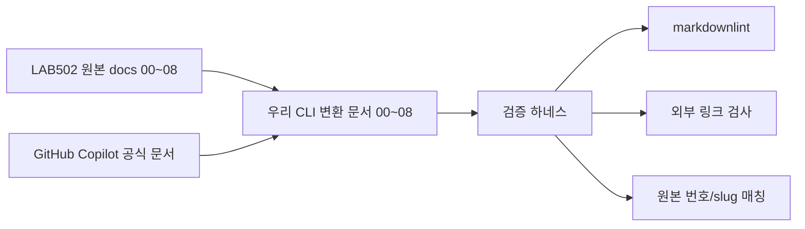

# LAB502 00~08 Copilot CLI 변환본

이 폴더는 Microsoft Build 2026 LAB502 원본 문서의 `00`~`08`을 **GitHub Copilot CLI 기준**으로 다시 정리한 한국어 실습 문서입니다.

파일명은 원본 문서 번호와 slug를 그대로 유지하고, 한국어 변환본 표시로 `.ko.md`만 붙입니다.

## 문서 매핑

| 원본 파일 | CLI 변환 파일 | 보강한 핵심 |
|---|---|---|
| `00-intro.md` | [00-intro.ko.md](00-intro.ko.md) | 전체 흐름, VS Code 단계의 CLI 대응 원칙 |
| `01-setting-up-the-environment.md` | [01-setting-up-the-environment.ko.md](01-setting-up-the-environment.ko.md) | 작업 폴더, Git 초기화, Copilot CLI 로그인 |
| `02-installing-the-community-plugin.md` | [02-installing-the-community-plugin.ko.md](02-installing-the-community-plugin.ko.md) | marketplace 등록, plugin 설치, 설치 검증 |
| `03-generating-the-space-invaders-game.md` | [03-generating-the-space-invaders-game.ko.md](03-generating-the-space-invaders-game.ko.md) | plan mode, 단일 HTML 게임 생성, `/diff` 확인 |
| `04-screenshot-sharing.md` | [04-screenshot-sharing.ko.md](04-screenshot-sharing.ko.md) | custom agent, Playwright MCP, `share-screenshot` skill |
| `05-exploring-copilot-customizations.md` | [05-exploring-copilot-customizations.ko.md](05-exploring-copilot-customizations.ko.md) | `/env`, `/instructions`, `/skills`, `/mcp`, `/plugin` |
| `06-creating-instructions.md` | [06-creating-instructions.ko.md](06-creating-instructions.ko.md) | `copilot init`, `/init`, `.github/copilot-instructions.md` |
| `07-creating-a-skill.md` | [07-creating-a-skill.ko.md](07-creating-a-skill.ko.md) | `.github/skills/<name>/SKILL.md`, helper scripts |
| `08-recap.md` | [08-recap.ko.md](08-recap.ko.md) | 커스터마이징 유형 선택 기준 |

## 리소스 연결

| 번호 | 로컬 문서 | 원본 문서 | 주요 공식 리소스 |
|---|---|---|---|
| 00 | [00-intro.ko.md](00-intro.ko.md) | [원본 00](https://github.com/microsoft/Build26-LAB502-make-github-copilot-work-your-way-custom-tools-context-and-workflows/blob/main/docs/00-intro.md) | [Copilot docs](https://docs.github.com/en/copilot) |
| 01 | [01-setting-up-the-environment.ko.md](01-setting-up-the-environment.ko.md) | [원본 01](https://github.com/microsoft/Build26-LAB502-make-github-copilot-work-your-way-custom-tools-context-and-workflows/blob/main/docs/01-setting-up-the-environment.md) | [Copilot CLI](https://docs.github.com/copilot/how-tos/copilot-cli) |
| 02 | [02-installing-the-community-plugin.ko.md](02-installing-the-community-plugin.ko.md) | [원본 02](https://github.com/microsoft/Build26-LAB502-make-github-copilot-work-your-way-custom-tools-context-and-workflows/blob/main/docs/02-installing-the-community-plugin.md) | [Copilot CLI plugins](https://docs.github.com/en/copilot/concepts/agents/copilot-cli/about-cli-plugins) |
| 03 | [03-generating-the-space-invaders-game.ko.md](03-generating-the-space-invaders-game.ko.md) | [원본 03](https://github.com/microsoft/Build26-LAB502-make-github-copilot-work-your-way-custom-tools-context-and-workflows/blob/main/docs/03-generating-the-space-invaders-game.md) | [CLI command reference](https://docs.github.com/en/copilot/reference/copilot-cli-reference/cli-command-reference) |
| 04 | [04-screenshot-sharing.ko.md](04-screenshot-sharing.ko.md) | [원본 04](https://github.com/microsoft/Build26-LAB502-make-github-copilot-work-your-way-custom-tools-context-and-workflows/blob/main/docs/04-screenshot-sharing.md) | [Custom agents](https://docs.github.com/en/copilot/how-tos/copilot-cli/use-copilot-cli-agents/invoke-custom-agents) |
| 05 | [05-exploring-copilot-customizations.ko.md](05-exploring-copilot-customizations.ko.md) | [원본 05](https://github.com/microsoft/Build26-LAB502-make-github-copilot-work-your-way-custom-tools-context-and-workflows/blob/main/docs/05-exploring-copilot-customizations.md) | [Copilot CLI skills](https://docs.github.com/en/copilot/how-tos/copilot-cli/customize-copilot/add-skills) |
| 06 | [06-creating-instructions.ko.md](06-creating-instructions.ko.md) | [원본 06](https://github.com/microsoft/Build26-LAB502-make-github-copilot-work-your-way-custom-tools-context-and-workflows/blob/main/docs/06-creating-instructions.md) | [Repository instructions](https://docs.github.com/en/copilot/how-tos/configure-custom-instructions/add-repository-instructions) |
| 07 | [07-creating-a-skill.ko.md](07-creating-a-skill.ko.md) | [원본 07](https://github.com/microsoft/Build26-LAB502-make-github-copilot-work-your-way-custom-tools-context-and-workflows/blob/main/docs/07-creating-a-skill.md) | [Agent skills](https://docs.github.com/en/copilot/concepts/agents/about-agent-skills) |
| 08 | [08-recap.ko.md](08-recap.ko.md) | [원본 08](https://github.com/microsoft/Build26-LAB502-make-github-copilot-work-your-way-custom-tools-context-and-workflows/blob/main/docs/08-recap.md) | [Copilot CLI plugins](https://docs.github.com/copilot/concepts/agents/copilot-cli/about-cli-plugins) |
| 검증 | [validate-lab502-cli-docs.ps1](../../tests/validate-lab502-cli-docs.ps1) | [원본 docs 전체](https://github.com/microsoft/Build26-LAB502-make-github-copilot-work-your-way-custom-tools-context-and-workflows/tree/main/docs) | markdownlint, 외부 링크, 번호 매칭 |

## 리소스 연결도



## 원본 CLI 이미지

원본 00~08 문서에서 Copilot CLI 흐름에 직접 쓰인 이미지는 [assets](assets)로 가져와 연결했습니다. VS Code UI 전용 이미지는 CLI 실습 흐름과 맞지 않아 제외했습니다.

| 파일 | 연결 문서 | 용도 |
|---|---|---|
| `copilog-in-terminal.png` | [01-setting-up-the-environment.ko.md](01-setting-up-the-environment.ko.md) | Copilot CLI 터미널 시작 화면 |
| `copilot-cli-git-status-execution-result.png` | [01-setting-up-the-environment.ko.md](01-setting-up-the-environment.ko.md) | CLI 안에서 shell 명령 실행 결과 |
| `copilot-asking-clarification.png` | [03-generating-the-space-invaders-game.ko.md](03-generating-the-space-invaders-game.ko.md) | plan mode 질문 예시 |
| `copilot-cli-plan-ready-review.png` | [03-generating-the-space-invaders-game.ko.md](03-generating-the-space-invaders-game.ko.md) | 계획 검토/승인 화면 |
| `msbld26-themed-space-invaders.png` | [03-generating-the-space-invaders-game.ko.md](03-generating-the-space-invaders-game.ko.md) | 생성된 게임 예시 |
| `copilot-cli-task-complete.png` | [03-generating-the-space-invaders-game.ko.md](03-generating-the-space-invaders-game.ko.md) | 생성 작업 완료 화면 |

## 원본에서 CLI로 바꾼 핵심

- VS Code UI 절차는 CLI slash command와 명령으로 치환합니다.
- `#index.html` 파일 첨부는 CLI에서 `@index.html`로 안내합니다.
- `/create-instructions`는 `copilot init` 또는 `/init`으로 바꿉니다.
- `/create-skill` wizard는 `.github/skills/<name>/SKILL.md`와 helper script 작성 흐름으로 바꿉니다.
- skill 추가 후 `/skills reload`, `/skills info <skill-name>`로 확인합니다.
- MCP와 plugin은 `copilot mcp list`, `copilot plugin list`, `/mcp`, `/plugin`로 확인합니다.

## 검증 하네스

문서 변환 결과는 아래 하네스로 확인합니다.

```powershell
.\tests\validate-lab502-cli-docs.ps1
```

외부 참고 링크까지 확인하려면 다음처럼 실행합니다.

```powershell
.\tests\validate-lab502-cli-docs.ps1 -CheckExternalLinks
```

## 참고 원본

- <https://github.com/microsoft/Build26-LAB502-make-github-copilot-work-your-way-custom-tools-context-and-workflows/tree/main/docs>
